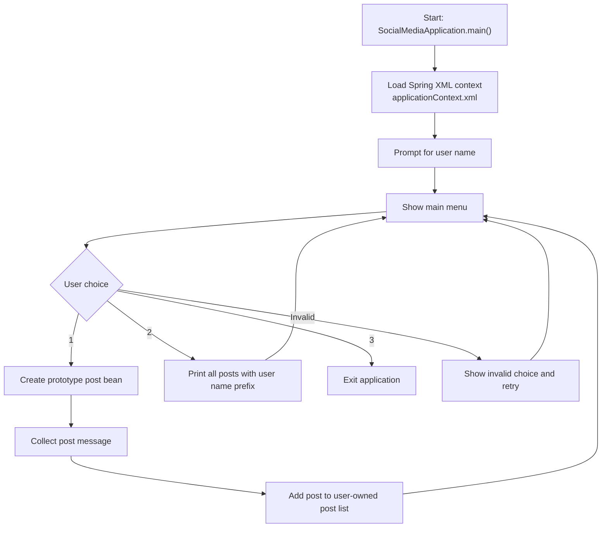

# Social Media Posts

Social Media Posts is a Java 17 console application that uses Spring XML bean configuration to create and list simple text posts for a session-based user.

## GitHub Metadata

- Suggested repository description: `Java 17 Spring console app for creating and listing user-specific social media posts with Spring XML wiring.`
- Suggested topics: `java`, `java-17`, `spring-framework`, `spring`, `maven`, `xml-configuration`, `dependency-injection`, `junit5`, `oop`, `console-application`, `social-media`, `learning-project`, `portfolio-project`

## Tech Stack

- Java 17
- Maven
- Spring Framework XML configuration
- JUnit 5

## Project Overview

The application models a simple social-media posting flow:

- `SimplePost` implements the `Post` interface.
- `SimplePostList` implements the `PostList` interface and stores posts for the session.
- `SimpleUser` implements the `User` interface and owns the post list for the current session.
- `SocialMediaWorkflow` manages console interaction and validation.
- `applicationContext.xml` wires a prototype post bean, a shared post-list bean, and a user bean.

## Current Flow

1. The application starts in `SocialMediaApplication`.
2. Spring loads `applicationContext.xml`.
3. The user enters a name for the current session.
4. The user chooses to create a post, show all posts, or exit.
5. If a post is created, the app collects the message and stores it in the user-owned post list.
6. The user can view all posts added during the current session with the username prefixed in the output.
7. The app exits when the user chooses option `3`.

## Flow Diagram



## How To Run

```bash
mvn test
mvn package
java -jar target/social-media-posts-0.0.1-SNAPSHOT.jar
```

If you prefer the Maven Wrapper, use `mvnw.cmd` on Windows or `./mvnw` on Unix-like systems.

## Sample Output

```text
Social media app starts.....
Please enter your name!
1- make new post
2- show all posts
3- exit
Please enter a post
Post created successfully.
All the posts!
0- Bipin Hello world
Exiting social media app.
```

## Known Limitations

- The application is console-based and does not expose a REST API.
- Posts are stored only for the current runtime session.
- There is still no persistence layer, likes, comments, or multi-user storage.

## Why This Repo Exists

This repository is intended as a learning and portfolio project that shows:

- Spring XML bean scopes
- interface-based design
- console workflow handling
- stateful in-memory collections
- automated tests for wiring and post-creation flow
